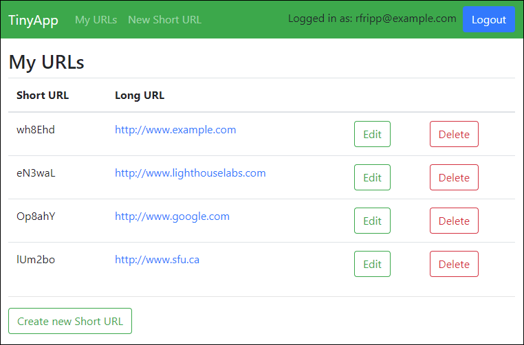
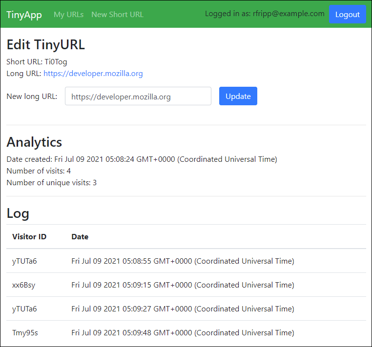

# TinyApp Project

- [About](#about)
- [Features](#features)
- [Final Product](#final-product)
- [Usage](#usage)
- [Error management](#error-management)
- [Known issues](#known-issues)
- [Dependencies](#dependencies)

---

## About

TinyApp is a full stack web application built with Node and Express that allows users to shorten long URLs (à la bit.ly).

---

## Features

The application allows users to create and store shortened URLs in their account. It implements a range of security features (no [plain text offender here](https://plaintextoffenders.com/)):

- password hashing
- cookie encryption

**Method overriding** is used to implement a REST API for PUT and DELETE methods.

**Analytics** are available per URL to track:

- the date of creation
- the total number of visits
- the number of unique visits (based on visitor cookies)
- a full log of every visit

---

## Final Product





---

## Usage

Clone the repository with [git](https://git-scm.com/):

```
git clone git@github.com:ycandau/tinyapp.git
```

Install all the dependencies with [npm](https://www.npmjs.com/):

```
npm install
```

Start the development web server:

```
npm start
```

Then use any browser as a client at `localhost:8080`.

---

## Error management

| Status code | Type               | Cause                                     |
| ----------- | ------------------ | ----------------------------------------- |
| 400         | Bad request        | Email or password is empty                |
| 400         | Bad request        | Email is already registered               |
| 401         | Unauthorized       | Email is not registered                   |
| 401         | Unauthorized       | Incorrect password                        |
| 401         | Unauthorized       | User is not logged in                     |
| 403         | Forbidden          | User does not own short URL               |
| 404         | Not found          | Short URL does not exist                  |
| 405         | Method not allowed | Method overridden: Use `PUT /urls/:id`    |
| 405         | Method not allowed | Method overridden: Use `DELETE /urls/:id` |

The last two error messages are in response to incorrect methods, as `POST` methods are overridden to implement a REST API:

- To edit an URL use `PUT /urls/:id` instead of `POST /urls/:id`
- To delete an URL use `DELETE /urls/:id` instead of `POST /urls/:id/delete`

---

## Known issues

Due to the behaviour requirements for the project, logging out leads to an error message:

- On logout the user cookie is deleted.
- The user is then redirected to `/urls`.
- This triggers an error message for a logged out user at `urls`.

The route is left as is to follow the behaviour requirements.

---

## Dependencies

- Node.js
- express
- morgan
- ejs
- bcryptjs
- cookie-session
